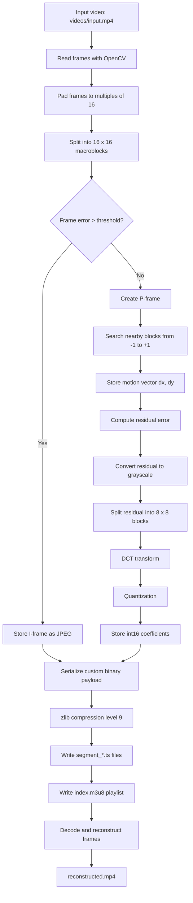
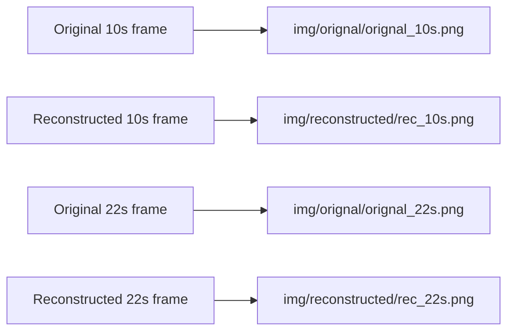

# Custom Streaming Codec

A learning-focused video compression project built in Python and OpenCV. It demonstrates how a video can be split into frames, compressed using I-frames and P-frames, stored as binary segments, and reconstructed again.

GitHub: <https://github.com/010Harsh010/custom-streaming-codec->

## Features

- 16 x 16 macroblock padding and block processing
- I-frame and P-frame based compression
- Motion-vector search from `-1` to `+1` around each macroblock
- Grayscale residual error encoding
- 8 x 8 DCT transform and quantization
- Custom binary serialization using `STR1` segment format
- `zlib` compression for compact segment files
- 5-second segment targeting with I-frame boundaries
- Frame logs, summary logs, reconstructed video, and visual reference images

## Project Structure

```text
.
|-- main.py
|-- pyproject.toml
|-- README.md
|-- videos/
|   `-- input.mp4
|-- segments/
|   |-- segment_0.ts
|   `-- ...
|-- img/
|   |-- orignal/
|   |   |-- orignal_10s.png
|   |   `-- orignal_22s.png
|   `-- reconstructed/
|       |-- rec_10s.png
|       `-- rec_22s.png
|-- info_log.txt
|-- frame_log.txt
|-- index.m3u8
|-- flow.mp4
|-- reconstructed.mp4
`-- project_report.html
```

## Requirements

- Python `3.11+`
- OpenCV
- NumPy

Dependencies are listed in `pyproject.toml`.

## Setup

Using `uv`:

```powershell
uv sync
```

Using `pip`:

```powershell
python -m venv .venv
.\.venv\Scripts\Activate.ps1
pip install opencv-python numpy
```

## Input Video

Place the input video at:

```text
videos/input.mp4
```

The current `main.py` reads this path directly:

```python
encoded, log, fps, Info_logs = process_video("videos/input.mp4")
```

## Run

Using `uv`:

```powershell
uv run python main.py
```

Using an activated virtual environment:

```powershell
python main.py
```

## Output Files

After running `main.py`, the project generates:

- `segments/segment_*.ts`: compressed binary video segments
- `index.m3u8`: playlist-style segment index
- `info_log.txt`: compression summary, frame counts, and segment sizes
- `frame_log.txt`: per-frame I-frame/P-frame log with timestamps
- `flow.mp4`: optical-flow motion visualization
- `reconstructed.mp4`: reconstructed output video

## Compression Pipeline



## Reference Images



The reference images compare source frames and reconstructed frames at the same timestamps. They help verify how close the decoded result is after motion prediction, residual coding, DCT, quantization, binary storage, and zlib compression.

## Logs

`info_log.txt` stores the run summary, including:

- raw padded data size
- FPS
- grayscale data size
- total frames
- I-frame count
- P-frame count
- encoded size
- segment frame ranges and segment sizes

`frame_log.txt` stores each frame's type and timestamp:

```text
Frame 0: I, Time: 0.00s
Frame 1: P, Time: 0.04s
Frame 2: P, Time: 0.08s
```

## Notes

- The first frame is always an I-frame so decoding has a full reference frame.
- New segments are started only at I-frames after about 5 seconds.
- P-frames depend on the previous reconstructed frame and store motion vectors plus residual coefficients.
- Grayscale residual coding reduces stored data, but it may lose some color-specific error detail.
